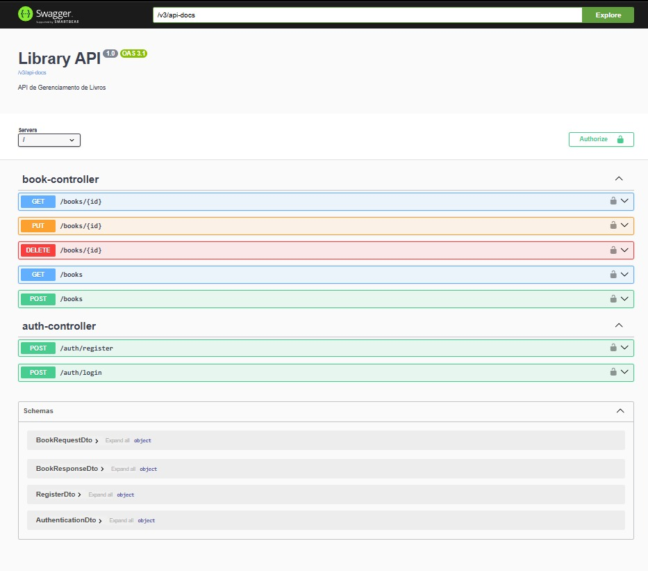
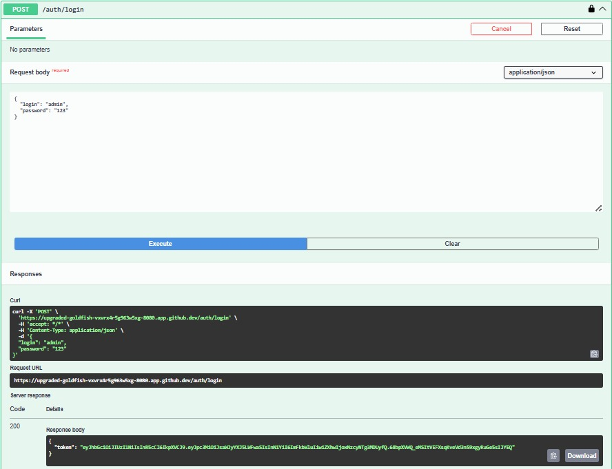
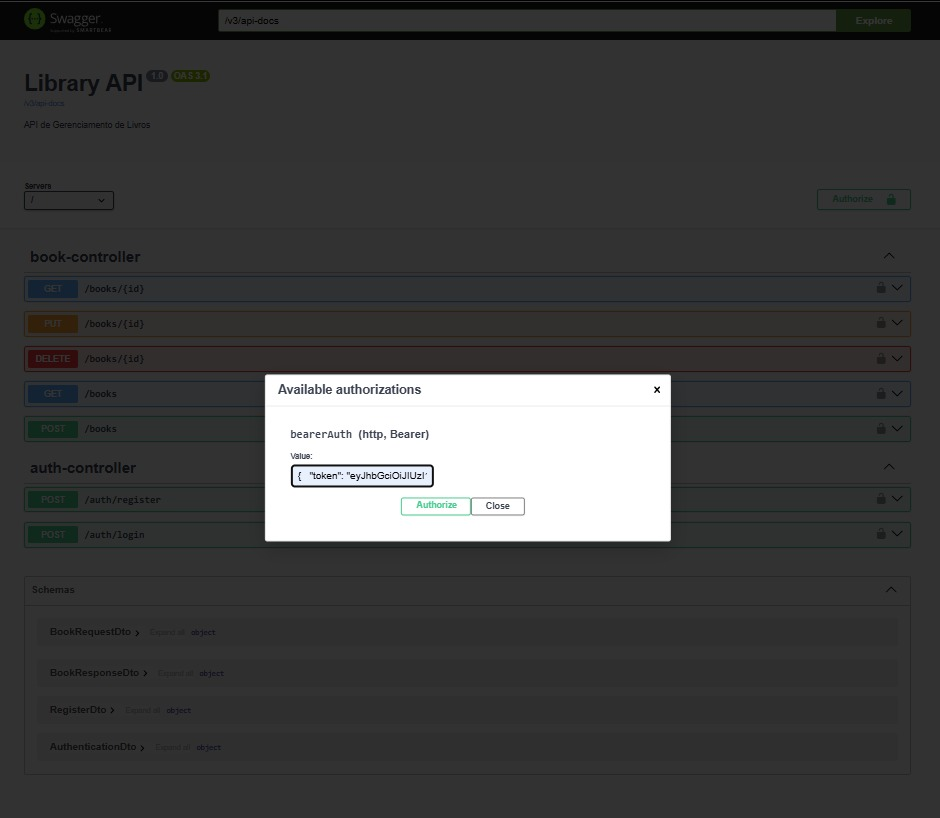
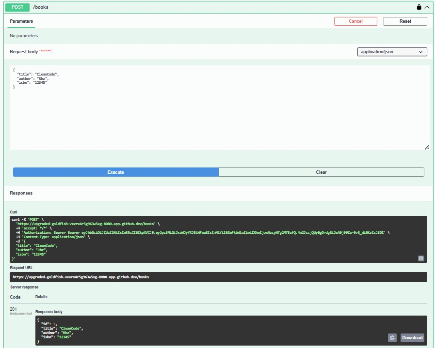
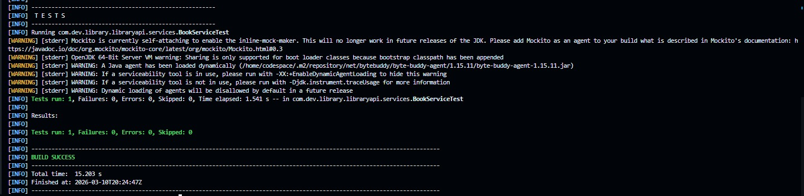

# 📚 Library API - Gestão de Biblioteca com Segurança JWT


## 💻 Sobre o Projeto
A **Library API** é uma solução robusta de back-end (RESTful) desenvolvida para o gerenciamento de acervos literários. O projeto implementa um sistema completo de **Autenticação e Autorização via JWT (JSON Web Token)**, garantindo que apenas usuários autenticados possam manipular dados sensíveis (Create, Update, Delete).

Este projeto utiliza **Arquitetura em Camadas** (Controller, Service, Repository, DTO, Model), tratamento global de exceções e validação de dados rigorosa.

## 🚀 Funcionalidades Principais
- **🔐 Autenticação Segura:** Registro e login de usuários com senhas criptografadas via **BCrypt**.
- **📖 CRUD de Livros:** Gerenciamento completo de títulos, autores e ISBNs.
- **🛡️ Controle de Acesso:** Endpoints de leitura (`GET`) são públicos, enquanto endpoints de escrita exigem Token Bearer.
- **📑 Swagger Interativo:** Documentação técnica que permite testar a API diretamente pelo navegador.
- **🛠️ Tratamento de Erros:** Respostas JSON padronizadas para erros de validação e exceções internas.

## 🛠️ Tecnologias Utilizadas
- **Java 17 & Spring Boot 3.4.3**
- **Spring Security & Auth0 Java JWT** (Segurança)
- **Spring Data JPA** (Persistência de dados)
- **H2 Database** (Banco de dados em memória para desenvolvimento)
- **Springdoc OpenAPI 2.8.5** (Swagger UI)
- **Maven** (Gerenciamento de dependências)

## 📸 Demonstração Técnica

### 1. Documentação Geral (Swagger)
Visão geral de todos os recursos disponíveis na API.


### 2. Autenticação e Token JWT
Processo de login para geração do Token de acesso.


### 3. Autorização (Bearer Token)
Configuração do Swagger para realizar requisições autenticadas.


### 4. Operações de Escrita (POST/PUT/DELETE)
Execução de cadastro de livros com o cadeado de segurança ativo.


### 5. Garantia de qualidade via testes automatizados
Execução de cadastro de livros com o cadeado de segurança ativo.


## ⚙️ Como Executar o Projeto

1. **Clone o repositório:**
   ```bash
   git clone [https://github.com/Rhyanzm/library-api-spring.git](https://github.com/Rhyanzm/library-api-spring.git)
